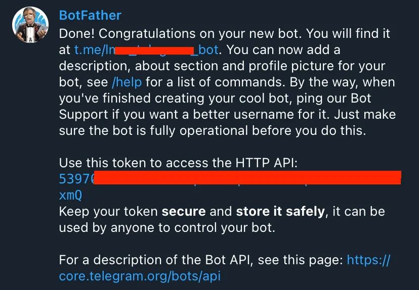

# Flask small app for monitoring services through a Telegram bot

Small Flask application to monitor deployed external/local services and receive notification messages in a Telegram group, chat or channel in case the services are down or have come back up.

## Software Installation Step by Step

# Tech you may need for a successfull installation and local deployment

| Name                | Installer                                                                                                                                                                                                                      |
|:--------------------|:-------------------------------------------------------------------------------------------------------------------------------------------------------------------------------------------------------------------------------| 
| `Compilator Engine` | [Python3](https://www.python.org/downloads/release/python-396/ "Python3")                                                                                                                                                      |
| `Programming IDE`   | [Visual Studio Code](https://code.visualstudio.com/ "Visual Studio Code"), [Sublime Text](https://www.sublimetext.com/ "Sublime Text"), [Pycharm](https://www.jetbrains.com/es-es/pycharm/download/#section=windows "Pycharm") |
| `Git`               | [Git](https://git-scm.com/downloads/ "Git")                                                                                                                                                                                    |

# Installation steps

##### 1) Download and unzip the project

##### 2) Create a local virtual environment to install the dependencies of the project

For windows:

```bash
python -m venv venv 
```

For linux:

```bash
virtualenv venv -ppython 
```

##### 3) Activate the virtual environment previously created

For windows:

```bash
cd venv\Scripts\activate.bat 
```
or 
```bash
.\venv\Scripts\Activate.ps1
```

For Linux:

```bash
source venv/bin/active
```

##### 4) Install all the dependencies of the project with the help of deploy folder

```bash
pip install -r deploy/txt/requirements.txt
```

##### 5) Create a Telegram Bot using Telegram’s BotFather
To use the Telegram API, you will need to create a Telegram bot and obtain its API key. You can do this by talking to the BotFather (A built-in Telegram bot that helps users create custom Telegram bots) in Telegram. To do this:
- Open the Telegram app on your smartphone or desktop.
- Search for the “BotFather” username in the search bar.
- Click on the “Start” button to start a conversation with the BotFather.
- Type /newbot to create a new bot.
- Give your bot a name & a username.
- Copy your new Telegram bot’s token in the specific part (TELEGRAM_API_BOT_TOKEN=<<your_telegram_api_bot_token>>) on the .env file
```bash
TELEGRAM_API_BOT_TOKEN=<<your_telegram_api_bot_token>>
```


Note: Don’t upload your token online, as anyone with your token has full control of your Telegram bot.

##### 6) Configure your corresponding site(s) domain(s) or service(s) with address, port and service_name in the .env file 

```bash
SERVICES='[
            ["https://<<your_domain_name_site_or_service>>", <<your_service_port>>, "<<Your Service Name>>"],
            ["http://<<your_domain_name_site_or_service>>", <<your_service_port>>, "<<Your Service Name>>"],
         ]'
TELEGRAM_API_BOT_TOKEN=<<your_telegram_api_bot_token>>
```

##### 7) Locate or create the chat, group or channel to which you wish to submit the monitoring messages on your Telegram application.

##### 8) Add the previously created bot to the Telegram chat, group or channel by typing "@your_bot_username" on the search bar of "Add Members" option.
```bash
@your_bot_username
```

##### 9) Run the next command
```bash
flask --app monitoring_services_app run-index
```

##### 10) Type the very first start command "/start" on the "Write a message..." bar.
```bash
/start
```